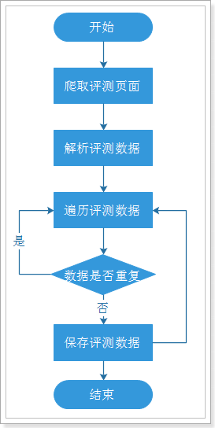

# crawler-autohome

## 一、项目描述

基于java网络爬虫，爬取汽车之家评测数据

## 二、技术特色

Quarter定时任务，SpringBoot、MyBatis、布隆过滤器、

 HttpClient+Jsoup+Quartz2.2、Junit4.12

#### Jsoup

Jsoup把输入的HTML转换成一个org.jsoup.nodes.Document对象，然后从文档对象中取出想要的元素

使用DOM的方式来取得

```java
getElementById（String id）：通过id来获取
getElementsByTag（String tagName）：通过标签名字来获取
getElementsByClass（String className）：通过类名来获取
getElementsByAttribute（String key）：通过属性名字来获取
getElementsByAttributeValue（String key，String value ）：通过指定的属性名字，属性值来获取
getAllElements（）：获取所有元素
```


## 三、实现功能

爬取 “汽车之家” 评测数据，下载汽车图片，爬取汽车的品牌、 车型、款式、加速、刹车、实测油耗，点评人姓名以及点评内容，采用云词进行车名、评论等分析生成词图

## 四、具体流程



## 五、数据处理

未完待续。。。

